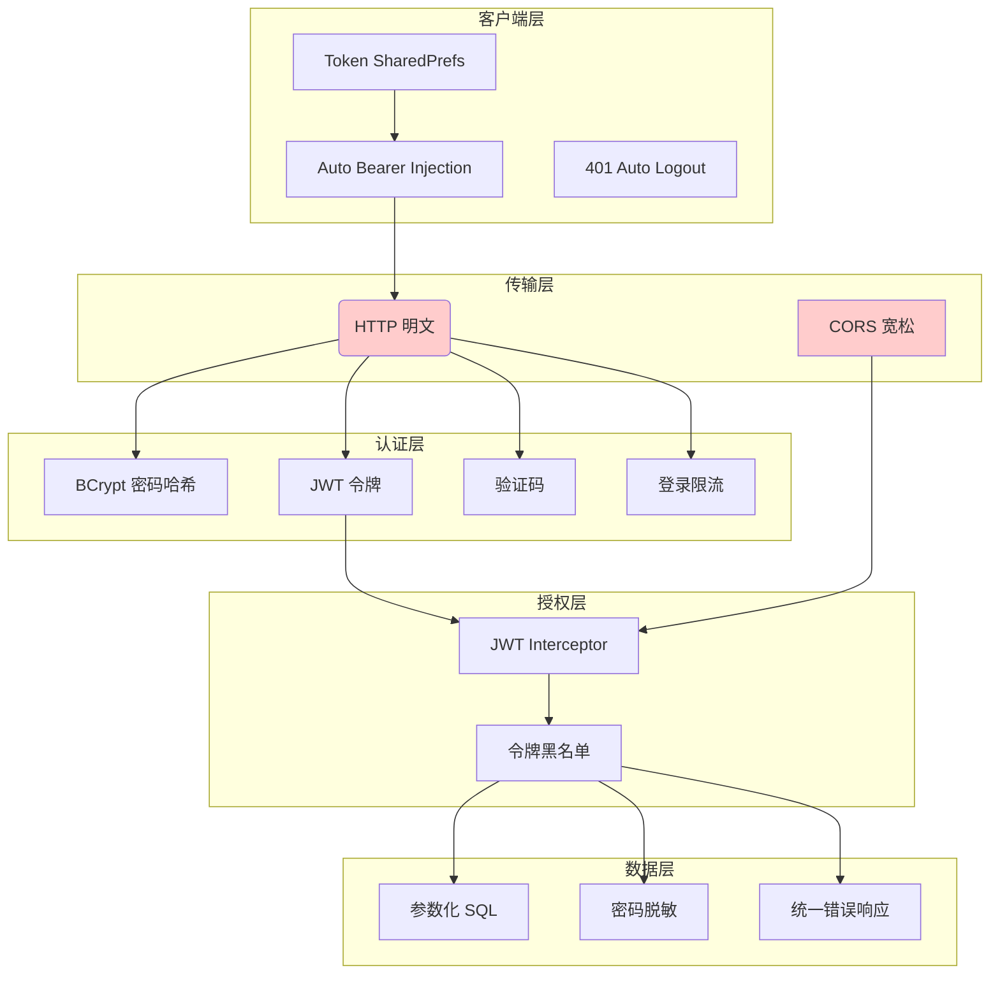

# 安全防护策略总结

> 更新日期：2026/06/23
> 审计范围：`note_backbond`（Java/Spring Boot 后端）+ `note_for_android`（Flutter 前端）

---

## 整体架构

```
┌──────────────────────┐       HTTP (非 HTTPS)        ┌──────────────────────┐
│  Flutter App (Android)│ ──────────────────────────▶ │  Spring Boot Backend │
│  Token: SharedPrefs  │                              │  Port 8080           │
└──────────────────────┘                              └──────┬───────────────┘
                                                            │
                                              ┌──────────────┴───────────────┐
                                              │  MySQL (无 SSL)    Redis (无密码)│
                                              └──────────────────────────────┘
```

---

## ✅ 已实现的防护措施

### 1. BCrypt 密码哈希

| 位置 | 描述 |
|---|---|
| `PasswordEncoderConfig.java` | Spring Security 的 `BCryptPasswordEncoder` 作为 Bean 注入 |
| `UserService.java:88` | 注册时 `passwordEncoder.encode(password)` 加密存储 |
| `UserService.java:150` | 登录时 `passwordEncoder.matches()` 验证 |
| `UserService.java:254-259` | 修改密码时先验证旧密码，再加密新密码 |

**结论：** 密码全程 BCrypt 加盐哈希，无明文存储或传输。

### 2. 登录暴力破解防护（Redis 限流）

```
Redis Key 设计:
  login:fail:account:<account>   → 失败次数（累加，自动过期）
  login:lock:account:<account>   → 锁定标记（15分钟自动过期）
```

- 最多 **5 次失败** 后锁定账户 **15 分钟**
- 首次失败时设置 Redis 键，带自动过期时间（无需手动清理）
- 失败计数使用 Redis **原子自增**，无并发竞态条件
- 登录成功后清除失败计数

### 3. 验证码系统

- 登录时必须携带验证码（`captchaKey` + `captchaCode`）
- 使用 `EasyCaptcha` 库生成 4 位数字验证码（130×48px）
- 验证码存储在 Redis，key 格式 `captcha:<uuid>`，**5 分钟 TTL**
- **一次性使用：** 验证通过后立即从 Redis 删除
- 验证码检查先于账户锁定检查，避免泄露账户存在性

### 4. JWT 令牌认证

```
请求流程:
  Client → Authorization: Bearer <token> → JwtInterceptor → Controller
```

- **HMAC-SHA256** 签名算法（JJWT 库）
- JWT 拦截器覆盖除公开端点外的所有路径：

  | 放行路径 | 说明 |
  |---|---|
  | `/user/login` | 登录 |
  | `/user/register` | 注册 |
  | `/user/token-info` | 令牌信息 |
  | `/captcha` | 获取验证码 |
  | `/hello` | 健康检查 |
  | `/error` | 错误页 |

- 令牌中包含 `userId`（`setId`）和 `account`（`setSubject`）
- 提取的用户信息存入 `request.setAttribute()`，供下游使用
- CORS 预检请求（`OPTIONS`）直接放行

### 5. 令牌注销黑名单

- 登出时将当前令牌加入 Redis 的 `logout:token` Set
- 黑名单 TTL = 令牌最大有效期（7 天）
- **每次请求** 都检查令牌是否在黑名单中 → 即使 JWT 未过期也可立即作废

### 6. 防止用户名枚举

```
UserService.java:143-147:
  "账号或密码错误"   ← 账户不存在 和 密码错误 返回相同消息
```

- 登录失败的通用提示信息，不区分"账户不存在"和"密码错误"
- 锁定时提示剩余分钟数（用户体验与安全性的合理折中）

### 7. 敏感信息脱敏

- `UserService.java:45,201,226` — 查询用户后将 `password` 字段置 `null`
- `UserController.java:45,121` — 返回响应前同样置 `null`
- 密码从不返回给客户端

### 8. SQL 注入防护

- 全部数据库操作使用 **MyBatis-Plus 链式 Lambda 查询**

  ```java
  Wrappers.<User>lambdaQuery().eq(User::getAccount, account)
  ```

- 内置参数化查询，天然免疫 SQL 注入

### 9. 统一错误响应

```json
{
  "code": 200,      // 200=成功, 400=参数错误, 401=未授权, 500=服务端异常
  "message": "...",
  "data": null
}
```

- 所有异常包装为用户安全消息，**不返回堆栈信息**
- 无信息泄露风险

### 10. 修改密码需验证旧密码

- `UserController.java:162-175` — 修改密码必须同时提供 `oldPwd` 和 `newPwd`
- 服务端用 BCrypt `matches()` 验证旧密码后才更新

### 11. 前端令牌自动注入与 401 处理

- `http_client.dart:_TokenInterceptor` — 自动为每个请求注入 `Authorization: Bearer <token>`
- 收到 401 响应时，自动清除本地令牌并跳转登录页

### 12. 数据库约束

| 约束 | 作用 |
|---|---|
| `UNIQUE KEY uk_account (account)` | 账户唯一性 |
| 外键 `ON DELETE CASCADE / SET NULL` | 参照完整性 |
| `deleted_at` 软删除字段 | 数据可恢复 |

---

## ⚠️ 待改进的安全问题（按严重程度排序）

### 🔴 严重

| # | 问题 | 位置 | 描述 | 建议 |
|---|---|---|---|---|
| 1 | **JWT 密钥硬编码** | `JwtUtil.java:26` | 密钥字符串直接写在源码中，源码注释写明"生产环境应放在配置文件中" | 移至 `application.properties` 或环境变量 |
| 2 | **全链路无 HTTPS** | `application.properties:4`、`main.dart:8`、`AndroidManifest.xml:7`、`network_security_config.xml:4` | 后端 HTTP 8080，前端 HTTP 连接，Android 网络配置允许明文 | 配置 TLS 证书，启用 HTTPS 重定向 |
| 3 | **MySQL 无 SSL** | `application.properties:9` | `useSSL=false`，数据库通信未加密 | 设为 `useSSL=true` 并配置证书 |
| 4 | **数据库密码明文硬编码** | `application.properties:11` | 密码直接写在配置文件中并提交到版本控制 | 使用环境变量或密钥管理服务 |

### 🟠 中等

| # | 问题 | 位置 | 描述 | 建议 |
|---|---|---|---|---|
| 5 | **CORS 配置过松** | `WebConfig.java:20-23` | `allowedOriginPatterns("*")` + `allowCredentials(true)` 允许任意源携带认证信息 | 限制为已知域名列表 |
| 6 | **Redis 无密码** | `application.properties:26-32` | Redis 使用默认配置（localhost:6379，无认证） | 配置 `spring.redis.password` |
| 7 | **前端令牌明文存储** | `user_store.dart:38` | 令牌保存在 `SharedPreferences`（Android 内部存储明文 XML） | 使用 `flutter_secure_storage`（Android Keystore） |
| 8 | **输入校验不足** | `UserService.java` 多处 | 仅有非空和最小长度校验，缺少格式/字符白名单/长度上限 | 添加正则校验和长度限制 |

### 🟡 较低

| # | 问题 | 位置 | 描述 | 建议 |
|---|---|---|---|---|
| 9 | **令牌有效期 7 天无刷新** | `JwtUtil.java:28` | 令牌过期后必须重新登录 | 实现 Refresh Token 或缩短有效期 |
| 10 | **验证码强度偏低** | `CaptchaController.java:43` | 4 位纯数字（10,000 种组合） | 5-6 位字母数字混合 |
| 11 | **无接口限流** | 全部 API | 任何端点均可被高频调用 | 引入网关层或 Spring 过滤器限流 |
| 12 | **测试凭据硬编码** | `auth_screen.dart:15-16` | 默认填充 `test / 123456` | 生产环境移除 |
| 13 | **无 CSRF 防护** | 全局 | Bearer Token 认证的移动应用不需 CSRF | 文档备注即可 |

---

## 🏗️ 安全架构分层图



---

## 📈 安全成熟度评分

| 维度 | 评分 | 说明 |
|---|---|---|
| 密码存储 | ★★★★★ | BCrypt 加盐哈希，无明文 |
| SQL 注入防护 | ★★★★★ | 参数化查询全覆盖 |
| 认证机制 | ★★★★☆ | JWT + BCrypt，缺密钥管理 |
| 暴力破解防护 | ★★★★☆ | Redis 限流 + 验证码 |
| 敏感数据脱敏 | ★★★★★ | 密码从不回传 |
| 输入校验 | ★★☆☆☆ | 仅有非空和最小长度 |
| 传输加密 | ☆☆☆☆☆ | 全链路 HTTP 明文 |
| 密钥/凭据管理 | ☆☆☆☆☆ | 全部硬编码在源码中 |
| 前端安全存储 | ★★☆☆☆ | SharedPreferences 明文 |
| 日志/错误安全 | ★★★★☆ | 统一格式，不泄露堆栈 |

---

## 总结

### 做得好的方面

- ✅ BCrypt 密码哈希贯穿全流程
- ✅ Redis 驱动的登录限流 + 验证码双重防护
- ✅ 泛化错误信息，防止用户名枚举
- ✅ 令牌黑名单机制实现服务端注销
- ✅ 参数化查询天然免疫 SQL 注入
- ✅ 统一错误响应，无堆栈泄露
- ✅ 外键约束 + 软删除

### 优先修复项

1. **JWT 密钥 → 环境变量**（替换 `JwtUtil.java:26` 硬编码）
2. **启用 HTTPS**（后端证书 + 前端 `https://` + 移除 `usesCleartextTraffic`）
3. **数据库凭据 → 环境变量**（从 `application.properties` 移出）
4. **MySQL SSL 启用 + Redis 认证配置**
5. **前端令牌存储 → `flutter_secure_storage`**

> **总体评价：** 项目在**认证业务逻辑**（BCrypt、JWT、验证码、限流）方面做得比较扎实，但在**基础设施安全**方面存在明显短板——全链路 HTTP 明文传输、密钥/凭据硬编码、缺乏输入校验是三个最需要优先修复的问题。
